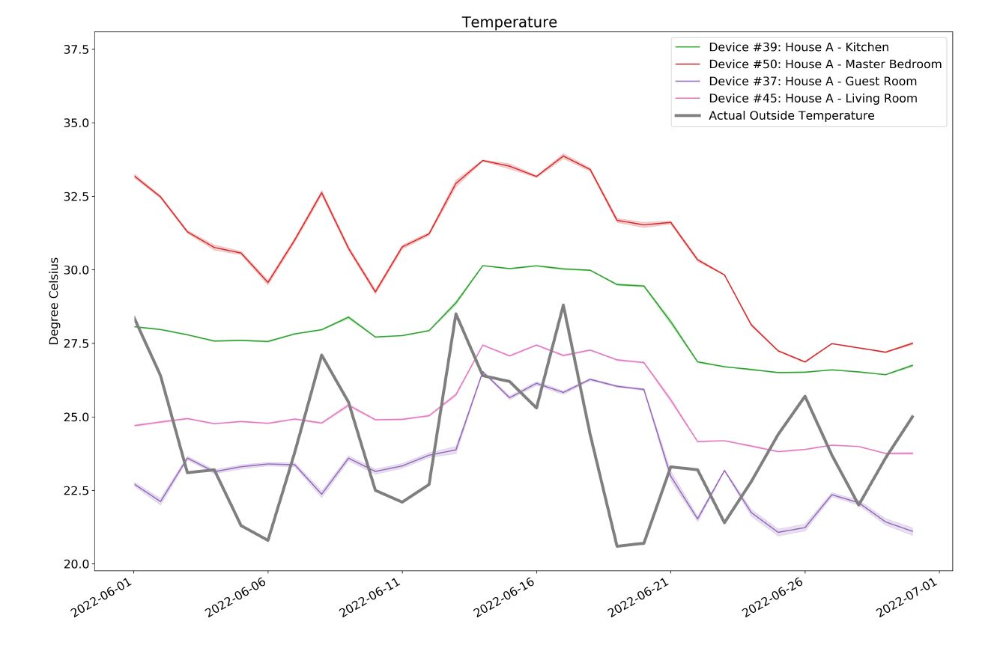

# A Comprehensive Indoor Environment Dataset from Single-family Houses in the US

This repository hosts a dataset composed of indoor environmental factors such as temperature, humidity, air quality, and noise levels. The data were collected from 10 sensing devices installed at various locations within three single-family houses in Virginia, USA. The objective of the data collection was to study the indoor environmental conditions of these houses over time. The data were gathered at a frequency of one record per minute for a year, yielding over 2.5 million records. The techniques used to collect the data, referred to as Building Data Lite (BDL), are described within [this repository](https://github.com/anik801/data_collection). The resulting dataset can be utilized to enhance models for building energy consumption, occupant behavior, predictive maintenance, and other related applications.

Project Team: [Sheik Murad Hassan Anik](https://www.linkedin.com/in/anik801/), [Dr. Ray Gao](http://www.raygaoai.com/), [Dr. Na Meng](https://people.cs.vt.edu/nm8247/) at Virginia Tech.

Check related research article [here](/papers/2023_BDL_data.pdf).

Repository includes:

- data files
- meta-data files
- code to validate data
- code to generate meta-data

Codes are written in Python 3 using Jupyter Notebook.

Data files are uploaded in the data folder. The files are distributed in "plus" and "reg" directories representing data from EnviroPlus and Enviro sensing boards. The data files are in CSV format. However, if file size is more than 100 MB, it is compressed as RAR (eg. RPI_30) and need to be decompressed prior to using. Any compression tool can be used for this task. We used WinRAR for compression.

All data is also available on [www.building-data-lite.com](http://www.building-data-lite.com/).

## Data Description

The data presented here has been collected through the Building Data Lite (BDL) sensing system. A total of 10 sensing nodes were deployed on various locations of 3 households. Each record in this dataset either contains 12 attributes for Enviro boards or 15 for Enviro+ boards. The attributes are represented as columns in the CSV files. Columns 1 to 3 represent unique identification information and timestamps. Each of the rest of columns represent an environmental attribute captured by the sensors. Columns 4 and 7 contain proximity and light data. LTR-599 LTR-599 sensor is used to measure surrounding proximity and light level. Without making any physical contact, the sensor is capable of identifying the existence of objects that are close by. Proximity is recorded in nano-meter (nm) unit and light is measured in Lux unit. Columns 5,6, and, 8 represent humidity, air pressure, and temperature data respectively. BME280 sensor is used to measure surrounding humidity, air pressure and temperature. These are measured in relative humidity (%RH), Hectopascal (hPa), and, Degree Celcius (°C) respectively.

The Enviro boards feature a microelectromechanical systems (MEMS) microphone designed to capture sound events. The recorded sound data is represented in columns 9 through 11, which respectively correspond to high, mid, and low sound levels. Column 12 represents the amplitude of sound. The recorded sound data can be utilized for different purposes depending on the application. All sound levels are measured in decibels (dB) unit, which is the standard unit for measuring sound intensity.

Columns 13 to 15 are only available in the Enviro+ CSV files. Columns 13, 14, and, 15 represent oxidised, reduced, and, amonia (nh3) data collected from the MICS6814 sensor. The Enviro+ board includes an analog-to-digital converter (ADC) which is useful for interpreting gas sensor readings. The (ADC) takes the voltage readings generated by the sensor, and, converts them into resistances that can vary from several hundred Ohms to several tens of thousands of Ohms based on the different gas levels that are present. Gas particle levels are recorded in forms of resistance (Ohms).

## Project Team and Contributors

[Sheik Murad Hassan Anik (soon to be PhD)](https://www.linkedin.com/in/anik801/)

[Dr. Ray Gao](http://www.raygaoai.com/)

[Dr. Na Meng](https://people.cs.vt.edu/nm8247/)

[Dr. Philip Agee](https://www.bc.vt.edu/people/agee)

[Dr. Andrew McCoy](https://www.bc.vt.edu/people/mccoy)
